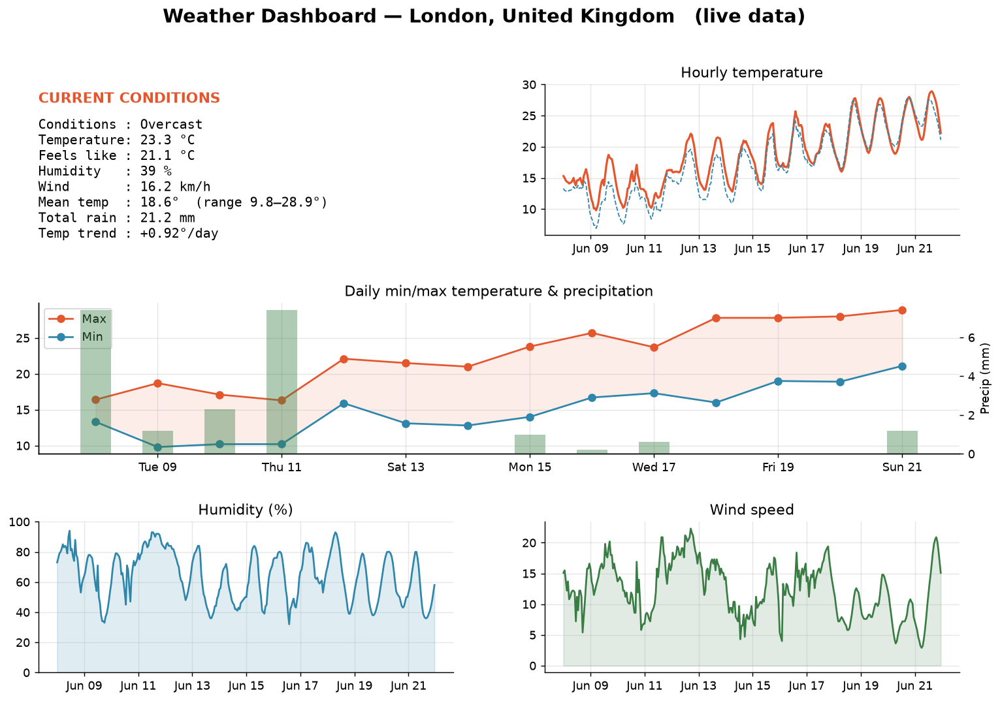
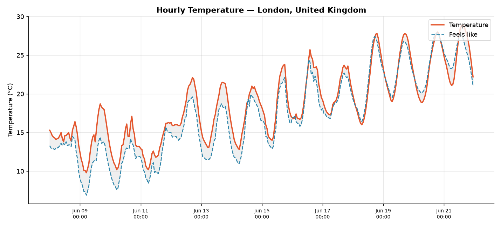
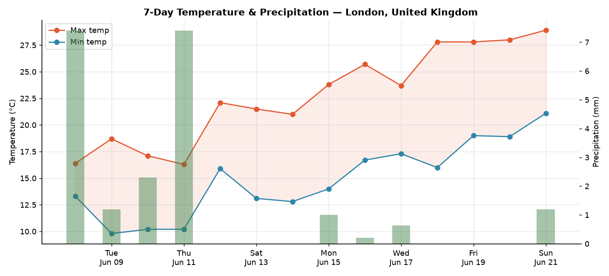
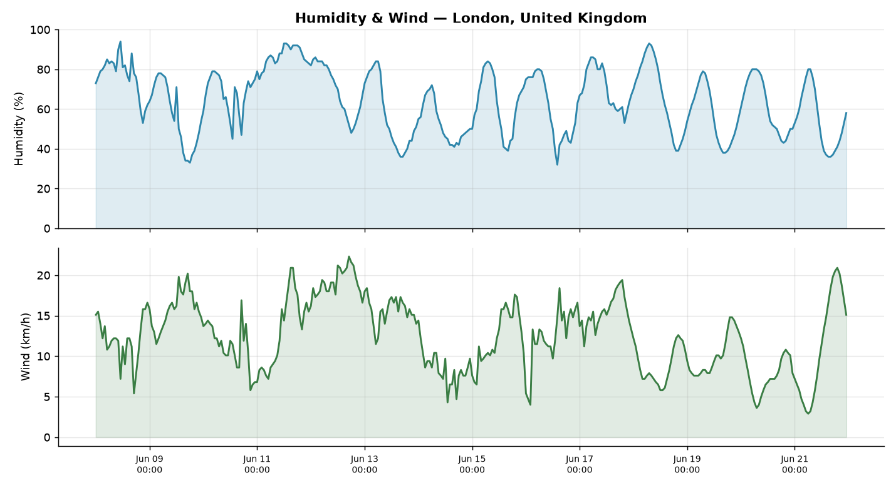
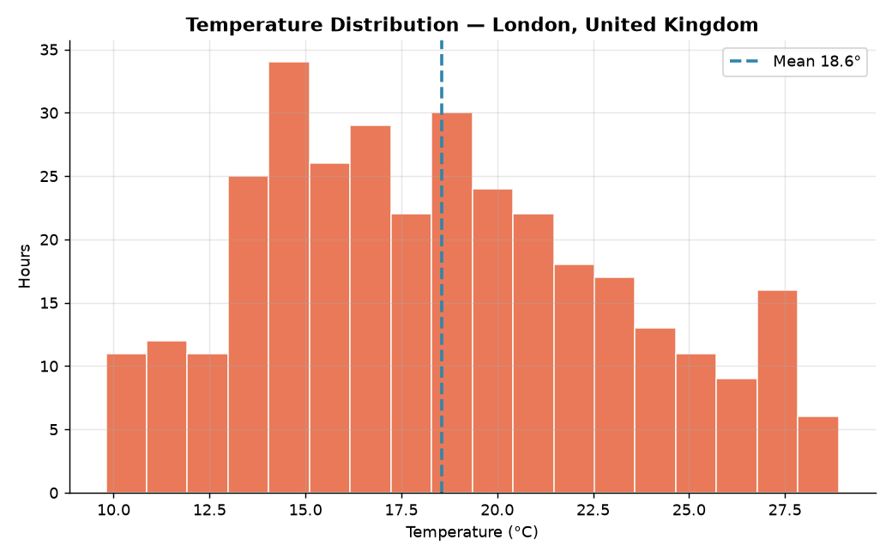

# 🌦️ Weather Analysis App

A self-contained Python application that pulls **live weather data**, analyses
it, and produces **publication-quality graphs** and a **Markdown report**.

It is built to *just work on any laptop*:

- **No API key, no sign-up.** Uses the free [Open-Meteo](https://open-meteo.com) API.
- **Works offline.** Ships with a real data snapshot, so it still produces full
  output with no internet connection (`--offline`).
- **Headless-safe.** Uses matplotlib's `Agg` backend — no display server needed.
- **Pure-Python dependencies** that install in seconds with `pip`.

---

## 📸 Screenshots

### Overview dashboard
A single-page summary of current conditions plus every key chart.



### Hourly temperature (actual vs. "feels like")


### 7-day temperature & precipitation


### Humidity & wind


### Temperature distribution


A full example report is in [`screenshots/report.md`](screenshots/report.md).

---

## 🚀 Quick start

```bash
# 1. Install dependencies (takes a few seconds)
pip install -r requirements.txt

# 2. Analyse any city with live data
python weather_app.py --city "Tokyo"

# 3. No internet? Use the bundled snapshot
python weather_app.py --offline
```

Charts and a `report.md` are written to the `outputs/` folder.

### Command-line options

| Option             | Default    | Description                                  |
|--------------------|------------|----------------------------------------------|
| `--city`           | `London`   | City name to analyse.                        |
| `--past-days`      | `7`        | Days of recent history to include.           |
| `--forecast-days`  | `7`        | Days of forecast to include.                 |
| `--outdir`         | `outputs/` | Where to save charts and the report.         |
| `--offline`        | off        | Use the bundled sample instead of the API.   |
| `--save-json PATH` | —          | Also dump the tidy data to a JSON file.      |

Examples:

```bash
python weather_app.py --city "New York" --past-days 14 --forecast-days 10
python weather_app.py --city "Mumbai" --save-json outputs/mumbai.json
```

---

## 📊 What it computes

- **Current conditions** — temperature, "feels like", humidity, wind, sky state
  (decoded from WMO weather codes).
- **Period summary** — mean / min / max temperature, warmest & coldest hours,
  mean humidity, total precipitation.
- **Temperature trend** — least-squares slope in °C per day (warming/cooling).
- **Correlations** — between temperature, humidity, precipitation and wind.
- **Daily statistics** — describe() table for min/max temp and precipitation.

## 📈 What it draws

1. **Dashboard** — everything on one page.
2. **Hourly temperature** — actual vs. apparent, with the gap shaded.
3. **Daily forecast** — min/max band + precipitation bars (dual axis).
4. **Humidity & wind** — stacked time series.
5. **Temperature distribution** — histogram with the mean marked.

---

## 🗂️ Project structure

```
weather-analysis-app/
├── weather_app.py          # CLI entry point
├── weather/
│   ├── geocoder.py         # city name  -> latitude/longitude
│   ├── fetcher.py          # live data  -> tidy pandas frames
│   ├── analyzer.py         # statistics, trends, correlations, WMO codes
│   ├── visualizer.py       # matplotlib charts + dashboard
│   ├── report.py           # Markdown report writer
│   ├── sample_data.py      # offline fallback loader
│   └── sample_payload.json # bundled real data snapshot
├── test_app.py             # offline smoke tests
├── requirements.txt
├── outputs/                # generated at runtime
└── screenshots/            # committed example output
```

## 🧪 Tests

```bash
python test_app.py
```

Runs entirely offline and verifies that data loads, statistics are consistent,
and all five charts plus the report are produced.

---

## ⚙️ How it works

1. `geocoder` resolves a city name to coordinates (Open-Meteo geocoding).
2. `fetcher` requests current + hourly + daily data (with recent history) and
   tidies it into pandas DataFrames indexed by time.
3. `analyzer` derives summary statistics, a linear temperature trend, and a
   correlation matrix.
4. `visualizer` renders five charts; `report` writes a linked Markdown summary.
5. If the network is unavailable, the app transparently falls back to the
   bundled snapshot so it never fails to produce output.

Data source: [Open-Meteo](https://open-meteo.com/) — free for non-commercial use.

## Author

**Varun Sharma** — BS in Data Science & Artificial Intelligence
