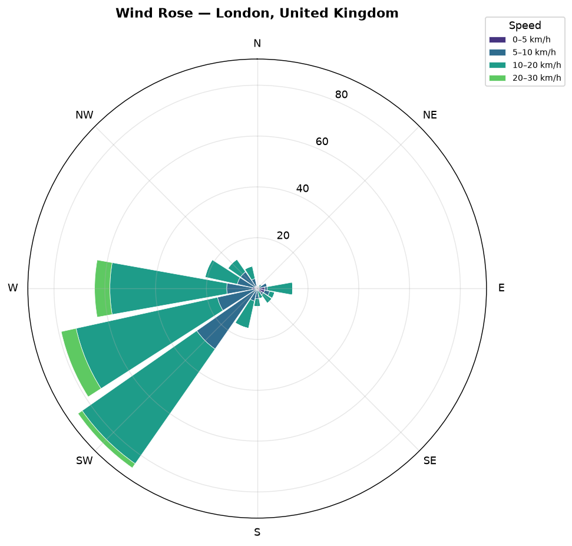
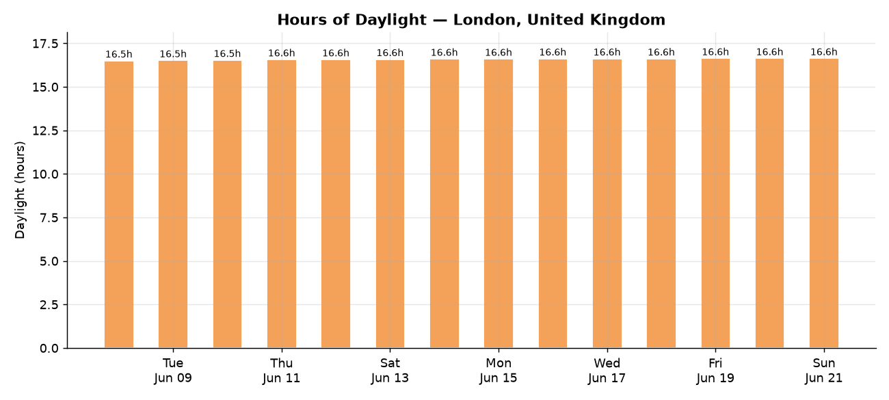
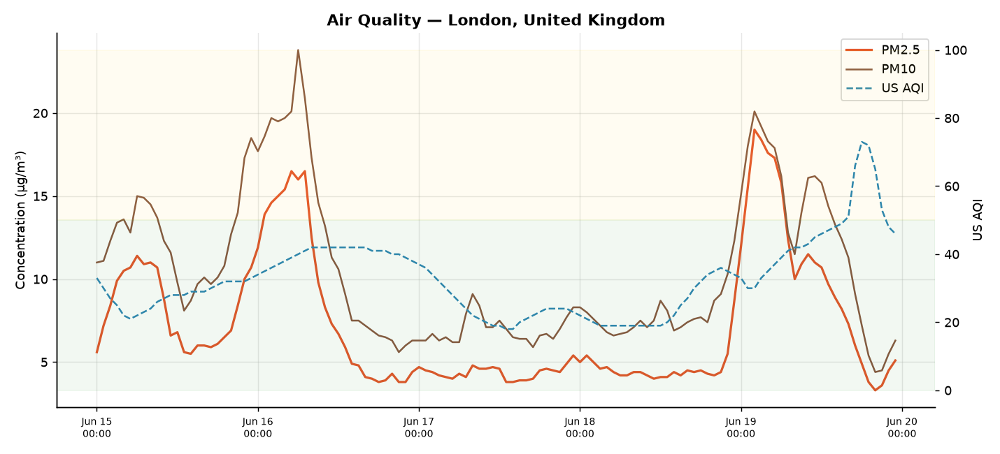

# Weather Analysis Report — London, United Kingdom

*Generated 2026-06-15 15:06 from **live** data (lat 51.509, lon -0.126).*

## Current conditions

- **Conditions:** Overcast
- **Temperature:** 23.4°C (feels like 21.0°C)
- **Humidity:** 39%
- **Wind:** 15.8 km/h

## Period summary

- **Mean temperature:** 18.6°C
- **Range:** 9.8°C to 28.9°C
- **Warmest hour:** 2026-06-21T15:00:00
- **Coldest hour:** 2026-06-09T05:00:00
- **Mean humidity:** 64.3%
- **Total precipitation:** 21.2 mm
- **Temperature trend:** +0.92 °C/day (warming)
- **Mean daylight:** 16.6 h (longest day 2026-06-19)
- **Air quality:** peak US AQI 73 (Moderate), mean PM2.5 7.3 µg/m³

## Correlations (hourly)

|                      |   temperature_2m |   relative_humidity_2m |   precipitation |   wind_speed_10m |
|:---------------------|-----------------:|-----------------------:|----------------:|-----------------:|
| temperature_2m       |             1    |                  -0.67 |           -0.19 |            -0    |
| relative_humidity_2m |            -0.67 |                   1    |            0.25 |            -0.18 |
| precipitation        |            -0.19 |                   0.25 |            1    |            -0.04 |
| wind_speed_10m       |            -0    |                  -0.18 |           -0.04 |             1    |

## Daily statistics

|       |   temperature_2m_max |   temperature_2m_min |   precipitation_sum |
|:------|---------------------:|---------------------:|--------------------:|
| count |                14    |                14    |               14    |
| mean  |                22.77 |                14.88 |                1.52 |
| std   |                 4.49 |                 3.55 |                2.58 |
| min   |                16.3  |                 9.8  |                0    |
| 25%   |                19.27 |                12.88 |                0    |
| 50%   |                22.9  |                14.95 |                0.42 |
| 75%   |                27.28 |                17.15 |                1.2  |
| max   |                28.9  |                21.1  |                7.4  |

## Charts

### Overview dashboard

### Hourly temperature (actual vs. feels-like)

### 7-day temperature & precipitation

### Humidity & wind

### Temperature distribution

### Wind rose (direction & speed)

### Hours of daylight

### Air quality (PM2.5 / PM10 / US AQI)

